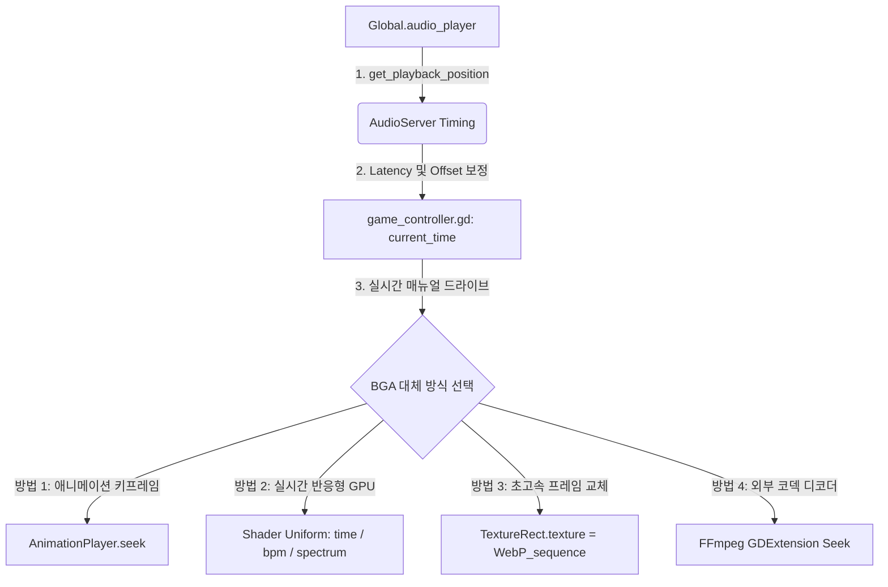

# 고도 엔진(Godot 4.x) VideoStreamPlayer를 대체하는 BGA 구현 방식 가이드

리듬 게임 개발 시 `VideoStreamPlayer`의 성능 저하(CPU 디코딩 과부하) 및 **임의 탐색(Seeking/싱크 교정) 불가능** 문제를 해결하기 위해, 게임의 비주얼 퀄리티와 최적화를 동시에 끌어올릴 수 있는 4가지 강력한 대안을 제시합니다.

---

## 📊 BGA 구현 방식 및 아키텍처 흐름

리듬 게임은 **오디오 서버 시간(Audio Clock)**이 마스터가 되어 모든 비주얼 요소를 강제로 끌고 가야 합니다. 아래 흐름도는 각 대안들이 마스터 클록(`current_time`)을 어떻게 매뉴얼 드라이브(Manual Drive)하는지 보여줍니다.



---

## 대안 1. AnimationPlayer 수동 구동 (스토리보드 & 벡터 연출)

> [!IMPORTANT]
> **추천 대상:** 스크린 필터 플래시, 노트 라인 줌인/아웃, 파티클 방출, 배경 오브젝트의 회전 및 크기 조절 등 **화려한 모션 그래픽 연출**이 위주인 게임 (예: *Just Shapes & Beats*, *Phigros*, *Osu!* 스토리보드 연출)

### 💡 동작 원리
`AnimationPlayer`의 내부 타이머를 엔진 프레임에 맡기지 않고 수동(`AnimationProcessMode.ANIMATION_PROCESS_MANUAL`)으로 돌린 뒤, 매 프레임 `_process()`에서 오디오 시간(`current_time`)을 직접 주입(`seek`)하여 완벽한 동기화를 구현합니다.

### 💻 GDScript 코드 구현

```gdscript
# ==============================================================================
# ManualAnimationBga.gd
# AnimationPlayer를 오디오 시간에 완전히 락(Lock)시키는 스크립트
# ==============================================================================
extends Node2D
class_name ManualAnimationBga

@onready var anim_player: AnimationPlayer = $AnimationPlayer

func _ready() -> void:
	# 1. 애니메이션 프로세스 모드를 MANUAL(수동)로 전환합니다.
	# 이 상태에서는 엔진의 델타 타임에 의해 애니메이션이 흐르지 않습니다.
	anim_player.callback_mode_process = AnimationPlayer.ANIMATION_CALLBACK_MODE_PROCESS_MANUAL
	anim_player.active = true

## game_controller.gd의 _process(delta) 내 오디오 싱크 연산 완료 직후 호출
func update_bga_sync(current_game_time: float) -> void:
	if not anim_player.active:
		return
		
	# 2. 타겟 애니메이션 이름 지정
	var target_anim = "stage_bga"
	
	if anim_player.current_animation != target_anim:
		anim_player.play(target_anim)
		
	# 3. seek(시간, update=true) 호출로 모든 노드 속성 강제 즉각 업데이트
	# 두 번째 인자인 'true'는 보간 및 노드 속성 업데이트를 강제로 즉각 수행하도록 지시합니다.
	anim_player.seek(current_game_time, true)
```

* **장점:**
  * **100% 프레임 단위 칼싱크:** 오디오 스레드 속도에 완벽 종속되어 0.1ms의 오차도 없습니다.
  * **용량 최적화:** 기가바이트 단위의 무거운 비디오 파일 대신, 수 킬로바이트(KB) 수준의 고도 씬 파일만 사용하므로 설치 용량이 극단적으로 줄어듭니다.
  * **디스플레이 최적화:** 유저 모니터 주사율(144Hz, 240Hz)에 대응해 서브픽셀 보간으로 극한의 부드러움을 냅니다.

---

## 대안 2. 실시간 반응형 GPU 셰이더 (제너레이티브 아트 연출)

> [!TIP]
> **추천 대상:** 테크노/사이버펑크 풍의 배경 터널 효과, 펄스 그리드, 실시간 오디오 스펙트럼 시각화 비주얼 (예: *Spin Rhythm*, *Arcaea*, *Synth Riders*)

### 💡 동작 원리
전체 화면을 덮는 `ColorRect`에 커스텀 Fragment 셰이더를 입히고, 오디오의 주파수 데이터 및 `current_time`을 Uniform 변수로 실시간 전달하여 GPU 연산으로 환상적인 비주얼을 그려냅니다.

### 💻 GDScript 및 Shader 코드 구현

#### 1. Fragment 셰이더 코드 (`bga_nebula.gdshader`)
```glsl
shader_type canvas_item;

uniform float u_time;        // 오디오 정밀 시간
uniform float u_bpm;         // 곡의 BPM
uniform float u_bass_pulse;  // 저음역대 스펙트럼 강도 (0.0 ~ 1.0)

void fragment() {
    vec2 uv = UV - 0.5;
    
    // 비트에 반응하는 회전 및 파동 수식 연산
    float beat_factor = sin(u_time * (u_bpm / 60.0) * PI * 2.0) * 0.1 * u_bass_pulse;
    float dist = length(uv) + beat_factor;
    
    // GPU로 실시간 그려내는 사이키델릭 네온 터널 효과
    float color_wave = sin(dist * 20.0 - u_time * 5.0);
    vec3 final_color = vec3(0.5 + 0.5 * color_wave, 0.2, 0.8 + 0.2 * sin(u_time));
    
    COLOR = vec4(final_color * (0.2 / dist), 1.0);
}
```

#### 2. 셰이더 제어 스크립트 (`GpuShaderBga.gd`)
```gdscript
# ==============================================================================
# GpuShaderBga.gd
# 오디오 분석기 데이터와 시간을 셰이더로 넘겨주는 스크립트
# ==============================================================================
extends ColorRect
class_name GpuShaderBga

@export var bpm: float = 120.0

var analyzer: AudioEffectInstance
var bass_effect_index: int = 0

func _ready() -> void:
	# AudioServer에서 오디오 스펙트럼 분석기 이펙트 가져오기 (사전 Bus 세팅 필요)
	# 'Master' 버스 등에 AudioEffectSpectrumAnalyzer를 달아 두어야 합니다.
	var bus_idx = AudioServer.get_bus_index("Master")
	for i in range(AudioServer.get_bus_effect_count(bus_idx)):
		if AudioServer.get_bus_effect(bus_idx, i) is AudioEffectSpectrumAnalyzer:
			bass_effect_index = i
			break

## game_controller.gd의 _process 에서 호출
func update_shader_sync(current_game_time: float) -> void:
	var material_ref: ShaderMaterial = material as ShaderMaterial
	if not material_ref:
		return
		
	# 1. 오디오 정밀 시간 주입 (시간 왜곡 방지)
	material_ref.set_shader_parameter("u_time", current_game_time)
	material_ref.set_shader_parameter("u_bpm", bpm)
	
	# 2. 실시간 오디오 스펙트럼 저음 분석 및 강도 계산
	var bass_intensity = 0.5
	if bass_effect_index >= 0:
		var bus_idx = AudioServer.get_bus_index("Master")
		var analyzer_instance = AudioServer.get_bus_effect_instance(bus_idx, bass_effect_index)
		if analyzer_instance:
			# 저음 영역 대역(20Hz ~ 150Hz) 주파수 에너지 구하기
			var mag = analyzer_instance.get_magnitude_for_frequency_range(20.0, 150.0)
			bass_intensity = clamp(mag.length() * 4.0, 0.0, 1.0)
			
	material_ref.set_shader_parameter("u_bass_pulse", bass_intensity)
```

* **장점:**
  * **초고성능:** CPU 디코딩 연산량이 **0%**에 수렴하며, 오로지 GPU 파이프라인에서만 병렬 처리되므로 랙이 근본적으로 차단됩니다.
  * **음악 반응성:** 음악 소리의 세기, 특정 주파수(드럼, 베이스)에 맞춰 배경이 실시간으로 진동하고 요동치는 인터랙티브 비주얼을 만들 수 있습니다.

---

## 대안 3. FFmpeg GDExtension 플러그인 (외부 네이티브 디코더)

> [!CAUTION]
> **추천 대상:** 유저가 직접 창작곡을 등록하는 시스템이 있어 일반 MP4/WebM 동영상 파일 재생 및 **자유로운 배속 재생, 정밀 역재생, 임의 시간 탐색(Seek)**이 필수적인 환경

### 💡 동작 원리
고도의 기본 `VideoStreamPlayer`를 버리고, C++ 네이티브 라이브러리로 FFmpeg를 연동한 GDExtension(예: `godot-videodecoder` 플러그인)을 장착합니다. 백그라운드 멀티스레드에서 동영상을 해독해 `ImageTexture`로 변환해 줍니다.

* **동작 및 제어 방식:**
  * 런타임 중 `video_decoder.seek(current_time)`을 직접 다이렉트로 호출할 수 있습니다.
  * 프레임 드랍이 심해져 오차가 50ms 이상 벌어지면 C++ 단에서 해당 프레임을 즉시 폐기(Skip)하고 스킵하여 정확한 시간에 복귀합니다.
* **단점:** C++ 네이티브 바이너리 파일들을 플랫폼별(Windows, Linux, Android, iOS 등)로 빌드 및 관리해야 하므로 플랫폼 이식 및 빌드 난이도가 대폭 상승합니다.

---

## 💡 요약 및 추천 로드맵

| BGA 방식 | 싱크 정밀도 | CPU 오버헤드 | VRAM 점유율 | 구현 난이도 | 추천 장르 |
| :--- | :---: | :---: | :---: | :---: | :--- |
| **VideoStreamPlayer** | 낮음 (Seek 제한) | 매우 높음 | 중간 | 매우 쉬움 | 일반 캐주얼 / BGA 품질 타협 가능 |
| **AnimationPlayer (수동)** | **최상 (0ms)** | 매우 낮음 | 매우 낮음 | 중간 | 스타일리시 노벨 / UI 중심 모션 그래픽 |
| **Procedural Shader** | **최상 (0ms)** | **제로 (0%)** | 극히 낮음 | 높음 (셰이더 공부 필요) | EDM / 3D 테크노 리듬 게임 |
| **Image Sequence (WebP)**| **최상 (0ms)** | 중간 (Disk I/O) | 매우 높음 (VRAM 캐시) | 매우 쉬움 | 고퀄리티 애니메이션 루프 / 2D 일러스트 BGA |
| **FFmpeg GDExtension** | 중간 | 높음 | 중간 | 매우 높음 | 커스텀 창작곡 지원 / 커뮤니티 중심 PC 리듬 게임 |

### 🛠️ 개발 방향 추천
1. **아트 스타일이 3D / 그래픽 위주인 경우:** **대안 1 (AnimationPlayer 수동 구동)** 방식을 메인으로 활용해 게임 내 판정선 스케일 펄스 및 카메라 워크를 구성하십시오.
2. **사이버/EDM 분위기의 멋진 배경을 저사양 프레임 드랍 없이 연출하고 싶다면:** **대안 2 (GPU 셰이더)** 방식을 통해 베이스 음역대에 맞춰 반응하는 멋진 화면을 그리십시오.
3. **일러스트/애니메이션 영상이 꼭 나와야 한다면:** 1편 가이드에서 소개한 **방법 B (Image Sequence - WebP 변환)** 방식을 사용하여 기기 호환성과 완벽한 싱크를 모두 잡으십시오.
